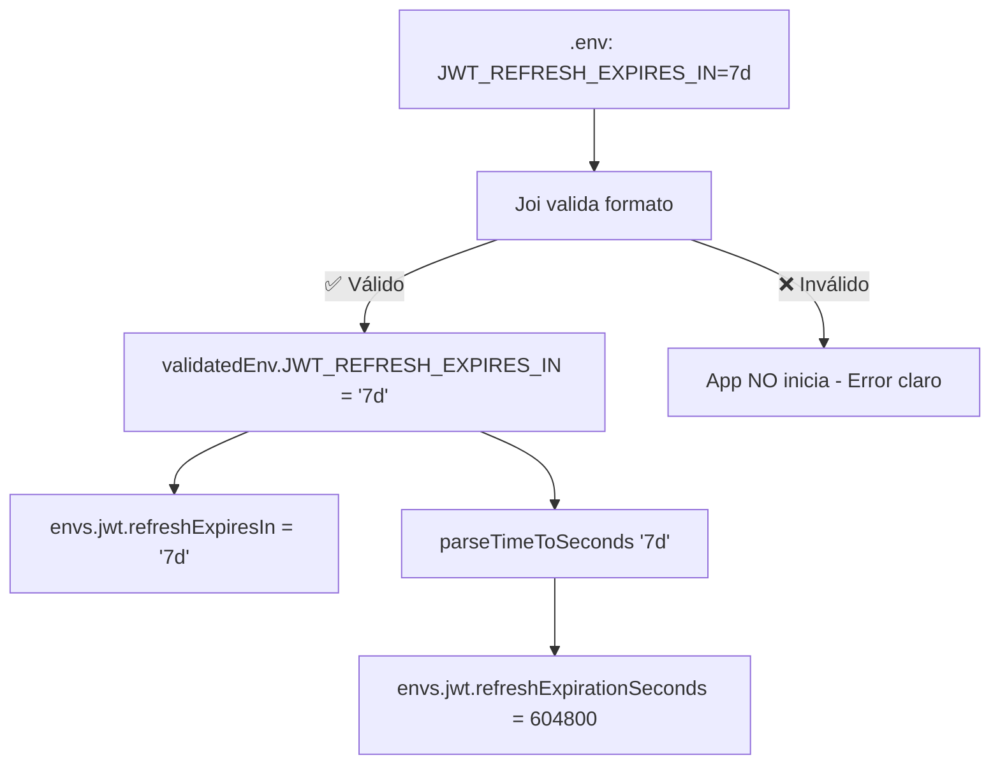

# JWT vs Redis: Manejo de Formatos de Tiempo

## 🤔 El Problema

JWT y Redis manejan tiempos de forma diferente:

| Sistema | Formato que espera | Ejemplo |
|---------|-------------------|---------|
| **JWT** (jsonwebtoken) | String: `"7d"`, `"1h"`, `"5m"` | `jwt.sign(payload, secret, { expiresIn: "7d" })` |
| **Redis** (SETEX/TTL) | Número en segundos: `604800` | `redis.setex(key, 604800, value)` |

### ❌ Si hacemos esto mal:
```typescript
// ❌ INCORRECTO
jwt.sign(payload, secret, { expiresIn: 604800 })  // JWT no entiende número
redis.setex(key, "7d", value)                     // Redis no entiende string
```

## ✅ La Solución Implementada

### 1. **Validación en `.env` con Joi**

```bash
# .env
JWT_REFRESH_EXPIRES_IN=7d    # ✅ Formato validado: <número><unidad>
```

```typescript
// envs.ts - Validación Joi
JWT_REFRESH_EXPIRES_IN: timeFormatValidator.default('7d'),
```

El validador `timeFormatValidator` usa regex: `/^\d+[smhd]$/`

**Formatos válidos:**
- `30s` → 30 segundos
- `5m` → 5 minutos
- `1h` → 1 hora
- `7d` → 7 días

**Formatos RECHAZADOS (app NO inicia):**
- `7w` → ❌ "w" (weeks) no soportado
- `1.5h` → ❌ Decimales no soportados
- `300` → ❌ Número sin unidad
- `-5m` → ❌ Negativos no soportados

### 2. **Conversión Dual: String + Segundos**

```typescript
// envs.ts (líneas 289-295)
jwt: {
  accessExpiresIn: validatedEnv.JWT_EXPIRES_IN as string,  // ✅ "15m" → para JWT
  refreshExpiresIn: jwtRefreshExpiresIn,                    // ✅ "7d" → para JWT
  refreshExpirationSeconds: parseTimeToSeconds(jwtRefreshExpiresIn),  // ✅ 604800 → para Redis
}
```

**Resultado:**
- JWT usa el string original: `envs.jwt.refreshExpiresIn` → `"7d"`
- Redis usa los segundos: `envs.jwt.refreshExpirationSeconds` → `604800`

### 3. **Función `parseTimeToSeconds()`**

```typescript
/**
 * Convierte "7d" → 604800 (segundos)
 */
function parseTimeToSeconds(timeStr: string): number {
  const units = {
    s: 1,        // segundos
    m: 60,       // minutos
    h: 3600,     // horas
    d: 86400,    // días
  }

  const match = timeStr.match(/^(\d+)([smhd])$/)
  if (!match) {
    throw new Error(`Invalid time format: "${timeStr}"`)
  }

  const [, value, unit] = match
  const seconds = parseInt(value, 10) * units[unit]

  // Validaciones adicionales
  if (seconds < 1) throw new Error('Time value too small')
  if (seconds > 31536000) throw new Error('Time value too large (max: 365d)')

  return seconds
}
```

**Ejemplos:**
```typescript
parseTimeToSeconds("5m")   // 300
parseTimeToSeconds("1h")   // 3600
parseTimeToSeconds("7d")   // 604800
parseTimeToSeconds("90d")  // 7776000
```

## 🔄 Flujo Completo

### En el arranque de la app:



### En uso real:

```typescript
// 1. JWT usa el string
const token = this.jwtService.sign(payload, {
  secret: envs.jwt.refreshSecret,
  expiresIn: envs.jwt.refreshExpiresIn,  // ✅ "7d" - String
})

// 2. Redis usa los segundos
await redis.setex(
  `auth:refresh:${userId}:${tokenId}`,
  envs.jwt.refreshExpirationSeconds,  // ✅ 604800 - Número
  JSON.stringify(session),
)
```

## 📊 Tabla de Conversiones Comunes

| .env | String (JWT) | Segundos (Redis) | Uso |
|------|--------------|------------------|-----|
| `15m` | `"15m"` | `900` | Access token |
| `7d` | `"7d"` | `604800` | Refresh token |
| `5m` | `"5m"` | `300` | 2FA code |
| `1h` | `"1h"` | `3600` | Reset password |
| `30d` | `"30d"` | `2592000` | Email verification |
| `90d` | `"90d"` | `7776000` | Trusted device |

## ✅ Garantías de Seguridad

### 1. **Validación Fail-Fast**
Si pones un formato inválido en `.env`, la app **NO inicia**:

```bash
# .env
JWT_REFRESH_EXPIRES_IN=7w  # ❌ "w" no soportado

# Al iniciar la app:
⚠️  Environment variables validation failed:
  - Time format must be: <number><unit>. Examples: 30s, 5m, 1h, 7d.
    Supported units: s=seconds, m=minutes, h=hours, d=days
```

### 2. **Validación de Rangos**
```typescript
// Valores extremos rechazados
parseTimeToSeconds("0s")    // ❌ Time value too small (must be at least 1 second)
parseTimeToSeconds("366d")  // ❌ Time value too large (maximum: 365d or 1 year)
```

### 3. **Tests Automatizados**
25 tests unitarios en `src/@core/config/__tests__/parse-time.spec.ts`:

```bash
npm test -- parse-time.spec.ts

# ✅ 25 tests passed
#   - Formatos válidos
#   - Formatos inválidos
#   - Integración JWT + Redis
#   - Valores por defecto
#   - Escenarios reales
```

## 🚀 Cómo Cambiar Configuración

### Desarrollo (tokens largos):
```bash
# .env
JWT_REFRESH_EXPIRES_IN=7d     # 7 días
TWO_FACTOR_CODE_EXPIRES_IN=5m  # 5 minutos
```

### Producción (tokens cortos - más seguro):
```bash
# .env
JWT_REFRESH_EXPIRES_IN=1d     # 1 día
TWO_FACTOR_CODE_EXPIRES_IN=3m  # 3 minutos
```

**Reiniciar la app:**
```bash
npm run dev
```

La validación asegura que el cambio sea correcto antes de iniciar.

## 🧪 Testing

### Test unitario de conversión:
```typescript
// src/@core/config/__tests__/parse-time.spec.ts
it('should convert time formats correctly', () => {
  expect(parseTimeToSeconds("5m")).toBe(300)
  expect(parseTimeToSeconds("1h")).toBe(3600)
  expect(parseTimeToSeconds("7d")).toBe(604800)
})
```

### Test E2E de integración:
```typescript
// test/auth.e2e-spec.ts
it('should store refresh tokens in Redis with correct TTL', async () => {
  await request(app.getHttpServer()).post('/auth/login').send(credentials)

  const keys = await redis.keys(`auth:refresh:${userId}:*`)
  const ttl = await redis.ttl(keys[0])

  expect(ttl).toBeGreaterThan(0)
  expect(ttl).toBeLessThanOrEqual(604800)  // 7 días en segundos
})
```

## 🔍 Debugging

### Ver valores parseados en logs:
```typescript
// En cualquier archivo
import { envs } from '@core/config'

console.log('JWT string:', envs.jwt.refreshExpiresIn)           // "7d"
console.log('Redis seconds:', envs.jwt.refreshExpirationSeconds) // 604800
```

### Verificar TTL en Redis:
```bash
redis-cli

# Ver todas las keys de refresh tokens
KEYS auth:refresh:*

# Ver TTL de una key específica
TTL auth:refresh:userId:tokenId

# Resultado: 604800 (segundos restantes)
```

## 📚 Referencias

- **Función de conversión**: `src/@core/config/envs.ts` (línea 28)
- **Validadores Joi**: `src/@core/config/envs.ts` (línea 68-94)
- **Export de config**: `src/@core/config/envs.ts` (línea 289-295)
- **Tests unitarios**: `src/@core/config/__tests__/parse-time.spec.ts`
- **Tests E2E**: `test/auth.e2e-spec.ts` (línea 594-609)
- **Token Storage**: `src/modules/auth/core/services/token-storage.repository.ts` (línea 28)

## 💡 Tips

### ✅ Hacer:
```typescript
// JWT usa string
jwt.sign(payload, secret, { expiresIn: envs.jwt.refreshExpiresIn })

// Redis usa segundos
redis.setex(key, envs.jwt.refreshExpirationSeconds, value)
```

### ❌ NO hacer:
```typescript
// ❌ JWT con segundos (no funciona)
jwt.sign(payload, secret, { expiresIn: 604800 })

// ❌ Redis con string (no funciona)
redis.setex(key, "7d", value)
```

## 🛡️ Seguridad

1. **Formato validado** → App NO inicia si es inválido
2. **Rangos controlados** → Min: 1s, Max: 365d
3. **Tests automatizados** → 25 tests unitarios + E2E
4. **Fail-fast** → Error claro en inicio de app
5. **Sin valores mágicos** → Todo en `.env` documentado

## 🎓 Resumen

**¿Por qué esto NO falla?**

1. ✅ **Joi valida** el formato ANTES de que la app inicie
2. ✅ **parseTimeToSeconds()** convierte de forma segura
3. ✅ **Dual export**: String para JWT, Número para Redis
4. ✅ **Tests automatizados** aseguran que funcione
5. ✅ **Mensajes de error claros** guían al usuario

**El sistema es robusto porque:**
- Si el formato es inválido → App NO inicia
- Si el valor es extremo → Se rechaza
- Si cambias `.env` → Joi revalida al reiniciar
- Si hay un bug → Los tests lo detectan
