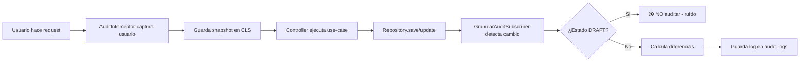

# Sistema de Auditoría Granular

Sistema de auditoría automática que registra todos los cambios en **Templates** y **Standards** con snapshots completos del usuario y diferencias campo por campo.

## ✅ Características

- **Automático**: Detecta cambios en `save()`, `update()`, `patch()`, `softDelete()` sin código adicional
- **Filtrado Inteligente**: NO audita cambios en estado DRAFT (evita ruido de edición)
- **Snapshot del Usuario**: Guarda ID + nombre completo + email (inmutable a cambios posteriores)
- **Desnormalización Inteligente**: Usa `rootId` para agrupar todo el historial de una plantilla
- **Cambios Granulares**: Detecta diferencias campo por campo automáticamente
- **Transaccional**: Se ejecuta dentro de la misma transacción (rollback automático si falla)
- **Performance**: Índices optimizados + consultas ligeras solo cuando es necesario

## 📋 Arquitectura

```
src/@core/audit-log/
├── entities/
│   └── audit-log.entity.ts       # Tabla audit_logs
├── subscribers/
│   └── granular-audit.subscriber.ts  # Detecta cambios automáticamente
├── repositories/
│   └── audit-log.repository.ts   # Consultas optimizadas
├── use-cases/
│   └── get-audit-history.use-case.ts  # Lógica de negocio
├── dtos/
│   └── get-audit-history.dto.ts  # DTOs para consultas
└── audit-log.module.ts           # Módulo completo
```

## 🔄 Flujo de Auditoría



## 🚦 Estrategia de Filtrado por Estado

El subscriber implementa un "Portero" inteligente que **filtra el ruido** de los cambios en modo edición:

### Estados del Template

| Estado | ¿Se Audita? | Razón |
|--------|------------|-------|
| **DRAFT** | ❌ NO | Modo edición - cambios experimentales (ruido) |
| **PUBLISHED** | ✅ SÍ | Modo producción - cambios críticos |
| **ARCHIVED** | ✅ SÍ | Histórico - cambios importantes |
| **Cambio de estado** | ✅ SÍ | Transiciones son eventos críticos |

### Ejemplos de Comportamiento

#### ❌ NO se audita (DRAFT):

```typescript
// Template en DRAFT
template.status = TemplateStatus.DRAFT

// Cambios durante edición (NO se auditan)
template.name = 'Borrador 1'        // ❌ No audita
template.name = 'Borrador 2'        // ❌ No audita
template.description = 'Probando'   // ❌ No audita

// Standard hijo también se ignora
standard.title = 'Prueba 1'         // ❌ No audita (padre en DRAFT)
standard.title = 'Prueba 2'         // ❌ No audita
```

**Resultado:** La tabla `audit_logs` permanece limpia, sin ruido.

#### ✅ SÍ se audita (PUBLISHED):

```typescript
// Momento de la publicación
template.status = TemplateStatus.PUBLISHED  // ✅ AUDITA cambio de estado

// Correcciones en producción
template.description = 'Typo corregido'     // ✅ AUDITA
standard.weight = 25                        // ✅ AUDITA (padre en PUBLISHED)
```

**Resultado:** Cada cambio en producción queda registrado.

### Lógica del Portero

```typescript
// Pseudo-código del filtro
function shouldAudit(event) {
  if (esTemplate) {
    // Si AMBOS estados (viejo y nuevo) son DRAFT → NO auditar
    if (oldStatus === DRAFT && newStatus === DRAFT) {
      return false  // 🔇 Ruido de edición
    }

    // Si cambia de estado o está en producción → SÍ auditar
    return true
  }

  if (esStandard) {
    // Consultar estado del Template padre
    const padre = await getTemplatePadre(standard.templateId)

    // Si el padre está en DRAFT → NO auditar
    if (padre.status === DRAFT) {
      return false  // 🔇 Padre en edición
    }

    // Padre en producción → SÍ auditar
    return true
  }
}
```

### Performance de la Consulta del Padre

Para Standards, el subscriber hace una consulta **ultra-ligera**:

```sql
-- Query optimizada (solo 1 campo)
SELECT status FROM templates WHERE id = :templateId;
```

**Performance:**
- ~1ms en DB local
- ~5ms en DB remota
- Se ejecuta solo para Standards (no para Templates)
- Se omite si la relación ya está cargada en memoria

## 📦 Estructura de Datos

### AuditLogEntity

```typescript
{
  // Snapshot del usuario (inmutable)
  userId: "uuid-del-usuario",
  userFullName: "Juan Pérez Gómez",
  userEmail: "juan.perez@empresa.com",

  // Identificadores
  entity: "Template" | "Standard",
  entityId: "uuid-de-la-entidad",
  rootId: "uuid-del-template",  // Agrupador

  // Acción
  action: "CREATE" | "UPDATE" | "DELETE" | "ARCHIVE" | "ACTIVATE" | "DEACTIVATE",

  // Cambios granulares
  changes: {
    "title": { old: "Título viejo", new: "Título nuevo" },
    "isActive": { old: false, new: true }
  },

  // Timestamp
  createdAt: "2026-01-21T10:30:00Z"
}
```

## 🚀 Uso

### 1. Configuración Inicial

#### Generar migración para la tabla `audit_logs`

```bash
npm run migration:generate -- src/@core/database/migrations/CreateAuditLogTable
npm run migration:run
```

#### Verificar que el módulo esté importado en AppModule

```typescript
// src/app.module.ts
import { AuditLogModule } from '@core/audit-log'

@Module({
  imports: [
    // ... otros módulos
    AuditLogModule,  // ✅ Ya está agregado
  ],
})
export class AppModule {}
```

### 2. Uso Automático (Sin código adicional)

El sistema funciona **automáticamente** cuando hagas operaciones CRUD:

```typescript
// En cualquier use-case de templates o standards
@Injectable()
export class UpdateTemplateUseCase {
  constructor(
    private readonly templateRepository: TemplatesRepository
  ) {}

  @Transactional()
  async execute(id: string, dto: UpdateTemplateDto) {
    const template = await this.templateRepository.findById(id)
    template.name = dto.name
    template.description = dto.description

    // ✅ Al guardar, automáticamente se crea un log en audit_logs
    return await this.templateRepository.save(template)
  }
}
```

**Lo que sucede internamente:**

1. El `GranularAuditSubscriber` detecta el cambio
2. Calcula las diferencias: `{ name: { old: "...", new: "..." }, ... }`
3. Obtiene el snapshot del usuario desde CLS
4. Guarda el log en la misma transacción

### 3. Consultar Historial

#### Backend: Use-Case

```typescript
import { GetAuditHistoryUseCase } from '@core/audit-log'

@Injectable()
export class TemplateHistoryService {
  constructor(
    private readonly getAuditHistoryUseCase: GetAuditHistoryUseCase
  ) {}

  async getTemplateHistory(templateId: string) {
    return await this.getAuditHistoryUseCase.execute({
      rootId: templateId,
      limit: 100  // Últimos 100 cambios
    })
  }
}
```

#### Frontend: Respuesta JSON

```json
[
  {
    "id": "log-uuid",
    "createdAt": "2026-01-21T10:30:00Z",
    "userId": "user-uuid",
    "userFullName": "Juan Pérez Gómez",
    "userEmail": "juan.perez@empresa.com",
    "entity": "Standard",
    "entityId": "standard-uuid",
    "rootId": "template-uuid",
    "action": "UPDATE",
    "changes": {
      "title": {
        "old": "Contraseñas",
        "new": "Política de Contraseñas"
      },
      "weight": {
        "old": 10,
        "new": 20
      }
    }
  },
  {
    "id": "log-uuid-2",
    "createdAt": "2026-01-21T09:15:00Z",
    "action": "CREATE",
    "changes": null
  }
]
```

### 4. Consultas Avanzadas

#### Por Template (con todos sus standards)

```typescript
const logs = await auditLogRepository.findByRootId(templateId, 100)
```

#### Por Entidad Específica

```typescript
const logs = await auditLogRepository.findByEntityId(standardId, 50)
```

#### Por Usuario

```typescript
const logs = await auditLogRepository.findByUserId(userId, 100)
```

#### Por Rango de Fechas

```typescript
const logs = await auditLogRepository.findByRootIdAndDateRange(
  templateId,
  new Date('2026-01-01'),
  new Date('2026-01-31')
)
```

## 🎯 Casos de Uso

### 1. Historial de Cambios en Template

```typescript
// GET /templates/:id/history
@Get(':id/history')
async getHistory(@Param('id') id: string) {
  const logs = await this.auditLogRepository.findByRootId(id, 100)

  return logs.map(log => ({
    date: log.createdAt,
    user: log.userFullName,
    action: log.action,
    entity: log.entity,
    changes: log.changes
  }))
}
```

**Respuesta:**
```json
[
  {
    "date": "2026-01-21T10:30:00Z",
    "user": "Juan Pérez Gómez",
    "action": "UPDATE",
    "entity": "Standard",
    "changes": {
      "title": { "old": "Contraseñas", "new": "Política de Contraseñas" }
    }
  }
]
```

### 2. Timeline de Auditor

```typescript
// GET /templates/:id/timeline
@Get(':id/timeline')
async getTimeline(@Param('id') id: string) {
  const logs = await this.auditLogRepository.findByRootId(id, 50)

  return logs.map(log => ({
    timestamp: log.createdAt,
    description: this.buildDescription(log),
    user: {
      name: log.userFullName,
      email: log.userEmail
    }
  }))
}

private buildDescription(log: AuditLogEntity): string {
  const changesList = Object.keys(log.changes || {}).join(', ')

  switch(log.action) {
    case 'CREATE':
      return `Creó ${log.entity} "${log.entityId}"`
    case 'UPDATE':
      return `Modificó ${changesList} en ${log.entity}`
    case 'ARCHIVE':
      return `Archivó ${log.entity}`
    default:
      return log.action
  }
}
```

### 3. Reporte de Auditoría

```typescript
// GET /audit/report?startDate=2026-01-01&endDate=2026-01-31
async generateAuditReport(startDate: Date, endDate: Date) {
  const logs = await this.auditLogRepository.findByRootIdAndDateRange(
    templateId,
    startDate,
    endDate
  )

  return {
    totalChanges: logs.length,
    byUser: this.groupByUser(logs),
    byAction: this.groupByAction(logs),
    byEntity: this.groupByEntity(logs),
    details: logs
  }
}
```

## 🔒 Seguridad y Privacidad

### Snapshot Inmutable

El usuario guardado es un **snapshot** en el momento de la acción:

✅ **Ventajas:**
- Si el usuario cambia su nombre → el historial mantiene el nombre original
- Si el usuario es eliminado → el historial sigue siendo legible
- No requiere JOINs con la tabla users (más rápido)

⚠️ **Consideración:**
- Si necesitas el estado actual del usuario, debes hacer un JOIN manual

### Datos Sensibles

El subscriber **NO audita** estos campos:
- `password`
- `updatedAt` (ruido)
- `updatedBy` (ya está en el snapshot)
- `deletedAt` (se maneja con acción ARCHIVE)

## 📊 Performance

### Índices Optimizados

```sql
-- Consulta principal: historial de template
CREATE INDEX idx_audit_logs_rootId_createdAt ON audit_logs(rootId, createdAt DESC);

-- Consulta por entidad específica
CREATE INDEX idx_audit_logs_entityId ON audit_logs(entityId);

-- Consulta por usuario
CREATE INDEX idx_audit_logs_userId ON audit_logs(userId);
```

### Query Típica

```sql
SELECT * FROM audit_logs
WHERE rootId = 'template-uuid'
ORDER BY createdAt DESC
LIMIT 100;
```

**Performance estimada:**
- 1M registros: ~10ms
- 10M registros: ~50ms (con índice)

## 🧪 Testing

### Test del Subscriber

```typescript
describe('GranularAuditSubscriber', () => {
  it('debe crear log cuando se crea un template', async () => {
    const template = await templateRepository.save({
      code: 'ISO-27001',
      name: 'ISO 27001:2022',
      version: '2022'
    })

    const logs = await auditLogRepository.findByEntityId(template.id)

    expect(logs).toHaveLength(1)
    expect(logs[0].action).toBe(AuditAction.CREATE)
    expect(logs[0].entity).toBe('Template')
  })

  it('debe detectar cambios granulares', async () => {
    const template = await templateRepository.findById(templateId)
    template.name = 'Nuevo nombre'
    await templateRepository.save(template)

    const logs = await auditLogRepository.findByEntityId(templateId)
    const updateLog = logs.find(l => l.action === AuditAction.UPDATE)

    expect(updateLog.changes).toEqual({
      name: { old: 'Nombre anterior', new: 'Nuevo nombre' }
    })
  })
})
```

## 🐛 Troubleshooting

### El subscriber no detecta cambios

**Causa:** El módulo `AuditLogModule` no está importado en `AppModule`

**Solución:**
```typescript
// src/app.module.ts
import { AuditLogModule } from '@core/audit-log'

@Module({
  imports: [
    AuditLogModule,  // ← Asegúrate de que esté aquí
  ]
})
```

### Se auditan cambios en DRAFT (ruido)

**Causa:** El filtro de estado está deshabilitado o hay un bug

**Verificar:**
```typescript
// granular-audit.subscriber.ts línea ~155
if (oldStatus === TemplateStatus.DRAFT && newStatus === TemplateStatus.DRAFT) {
  return false // ← Debe retornar false para filtrar
}
```

**Debug:**
```typescript
// Agrega console.log temporal
console.log('[DEBUG] oldStatus:', oldData.status, 'newStatus:', newData.status)
```

### Usuario aparece como "Sistema"

**Causa:** No hay usuario en CLS (petición sin autenticación)

**Verificar:**
```typescript
// El AuditInterceptor debe ejecutarse DESPUÉS de JwtAuthGuard
// Orden en AppModule:
APP_GUARD: JwtAuthGuard        // 1. Valida JWT
APP_INTERCEPTOR: AuditInterceptor  // 2. Captura usuario
```

### No se guardan algunos campos en changes

**Causa:** Los campos están en la lista de `ignoredFields`

**Verificar:**
```typescript
// granular-audit.subscriber.ts
const ignoredFields = ['updatedAt', 'updatedBy', 'deletedAt', 'version']
```

## 📚 Referencias

- **Entidad Principal**: `src/@core/audit-log/entities/audit-log.entity.ts`
- **Subscriber**: `src/@core/audit-log/subscribers/granular-audit.subscriber.ts`
- **Repositorio**: `src/@core/audit-log/repositories/audit-log.repository.ts`
- **AuditService**: `src/@core/database/audit.service.ts`
- **AuditInterceptor**: `src/@core/interceptors/audit.interceptor.ts`

## 🎓 Próximos Pasos

1. **Generar migración**: `npm run migration:generate -- src/@core/database/migrations/CreateAuditLogTable`
2. **Ejecutar migración**: `npm run migration:run`
3. **Testear**: Crea/actualiza un template y verifica que se cree el log
4. **Integrar en Frontend**: Consumir el endpoint de historial

## ✨ Ejemplos de UI

### Timeline Component

```vue
<template>
  <div class="audit-timeline">
    <div v-for="log in history" :key="log.id" class="timeline-item">
      <div class="timeline-badge">
        <ActionIcon :action="log.action" />
      </div>
      <div class="timeline-content">
        <h4>{{ formatAction(log) }}</h4>
        <p class="user">{{ log.userFullName }} ({{ log.userEmail }})</p>
        <p class="date">{{ formatDate(log.createdAt) }}</p>
        <div v-if="log.changes" class="changes">
          <span v-for="(change, field) in log.changes" :key="field">
            <strong>{{ field }}:</strong>
            <del>{{ change.old }}</del> → <ins>{{ change.new }}</ins>
          </span>
        </div>
      </div>
    </div>
  </div>
</template>
```

**Resultado visual:**

```
🟢 Juan Pérez Gómez creó el Template "ISO 27001:2022"
   juan.perez@empresa.com
   21 Ene 2026, 10:30

📝 María García modificó el Standard "Políticas de Contraseñas"
   maria.garcia@empresa.com
   21 Ene 2026, 09:15

   title: "Contraseñas" → "Política de Contraseñas"
   weight: 10 → 20
```
